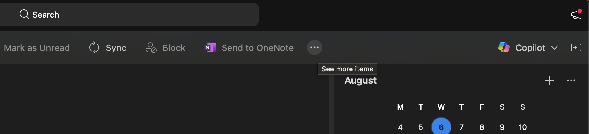
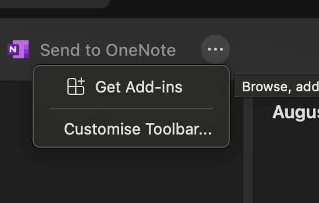
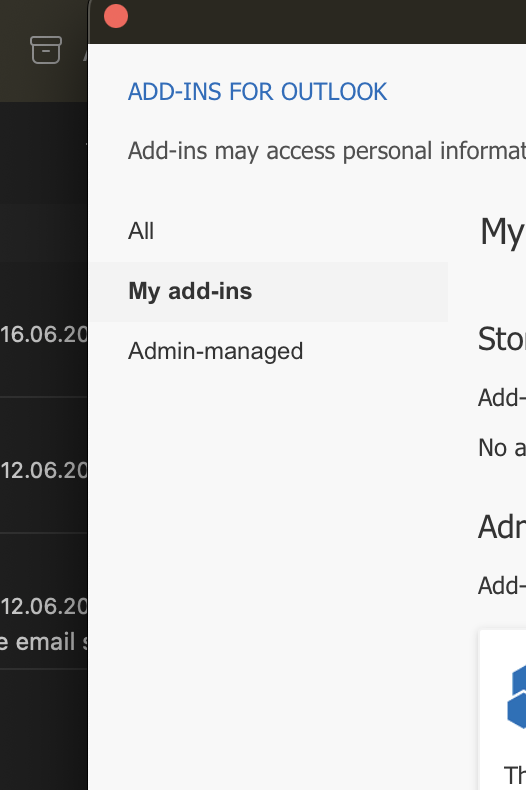
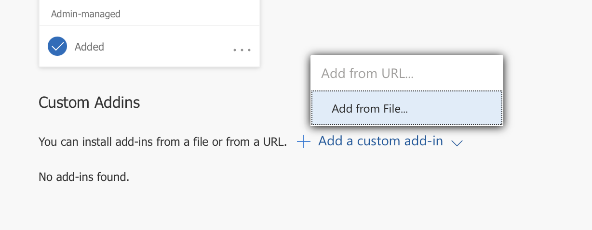
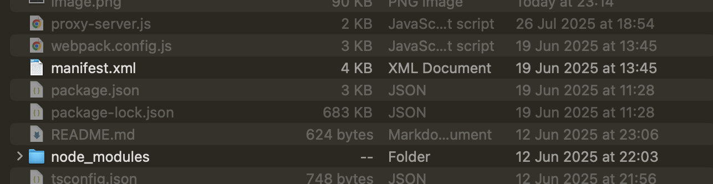
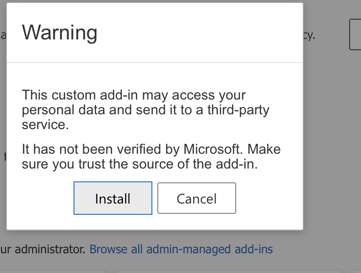
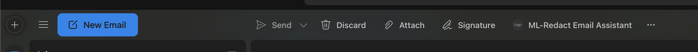
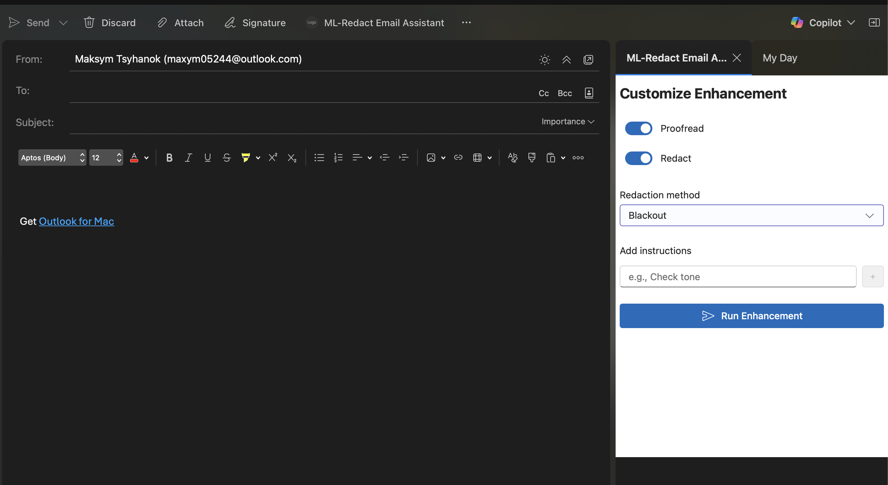

# 📧 Outlook Email Cleaner Plugin

A plugin that enhances Outlook email composition with proofreading and redaction features.

## ✅ Prerequisites

Before getting started, make sure the following are installed:

- **Node.js** and **npm**  
  [Download Node.js](https://nodejs.org)

- **Git**  
  [Download Git](https://git-scm.com)

To verify installation, run:

```bash
node -v
npm -v
git --version
```

## 🚀 Getting Started

### 1. Clone the repository

```bash
git clone git@github.com:heaven-soft/machine-learning-solutions.git
cd machine-learning-solutions
```

### 2. Install dependencies

```bash
npm install
```

### 3. Create a `.env` file based on `.env.example` and fill in the required fields.

### 4. Start the dev server (with HTTPS support)

```bash
npm run dev-server
```

You may be asked to enter your system password to generate SSL certificates.

### 5. Start the local proxy server

```bash
node proxy-server.js
```

This allows Outlook to communicate securely with the backend.


## 📨 Load the Plugin in Outlook

Open Outlook and click **See more items (...)** in the top ribbon.



Then click **Get Add-ins**.



Go to the **My Add-ins** tab.



Click **Add a custom add-in → Add from file...**



Select the `manifest.xml` file from your project root.



Click **Install**.



Now, when composing a new email, you’ll see the plugin in your toolbar.



Click it to launch the ML-Redact sidebar.


